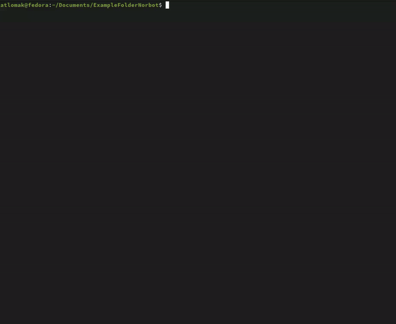
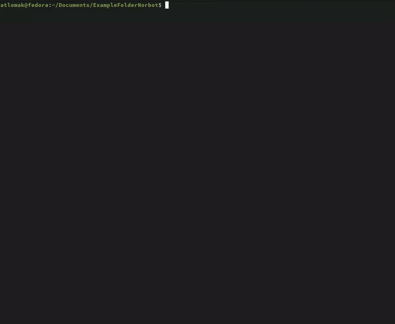

```
    _  __  ____    ___    ___   ____  ______
   / |/ / / __ \  / _ \  / _ ) / __ \/_  __/
  /    / / /_/ / / , _/ / _  |/ /_/ / / /   
 /_/|_/  \____/ /_/|_| /____/ \____/ /_/     
Your little assistant for folder upkeeping.
```

## Building from source
### Prerequisites
 - Golang >= 1.23

Then in project root directory, run following command:
```bash
go build ./cmd/norbot
```

## Usage
To run the Norbot:
 1. Set `GEMINI_API_KEY` environment variable with your api key
(you can get it [here](https://aistudio.google.com/app/apikey)),\
 2. Run `Norbot` in the folder you would like to clean a bit.

Press `enter` to unleash the cleaning gnome...\
Norbot will analyze your files and propose a better organization.


### Prompt
Want to provide additional instructions to guide Norbot?
Press `p` to add a custom prompt.



### Exclude results
Not happy with Norbot's suggestions?\
You can review and exclude specific files from the changes by selecting them and pressing `space`.\
If everything looks good, press `y` to let Norbot do its job.



---

## Disclaimer

Norbot is an early version hobby project and leverages a language model (LLM) to assist in file organization.\
Mistakes might happen.\
Always review the suggested changes before applying them, and feel free to provide feedback to help improve future versions.
