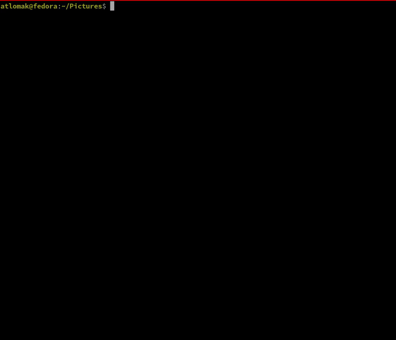

```
    _  __  ____    ___    ___   ____  ______
   / |/ / / __ \  / _ \  / _ ) / __ \/_  __/
  /    / / /_/ / / , _/ / _  |/ /_/ / / /   
 /_/|_/  \____/ /_/|_| /____/ \____/ /_/     
Your little assistant for folder upkeeping.
```

## Building from source
### Prerequisites
    Golang >= 1.23
```
go build ./cmd/norbot
```

## Usage
Set `GEMINI_API_KEY` environment variable with your api key,\
then run the `Norbot` in the folder you would like to clean a bit.\
After pressing enter, he will come up with an idea how to organize your files.



Current version does not support adding additional prompt yet,
but it's on my todo list.

Enjoy pointlessly blowing leafs... eh files around :)